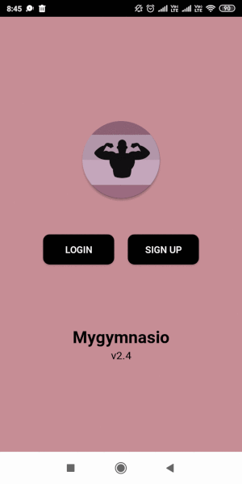

# Full-fledged ready-to-use multi-tenant gym management app built in react-native 

The project has 50+ screens and actions. 
The backend of this project is powered by Java Springboot, contributed by https://github.com/atulkgupta9.

 <b>Purpose of building this app</b> 

This app was built with a purpose of solving a problem in mind, by me and my batchmate(atulkgupta9). We wanted to build a one-stop-solution software for all training/fitness centers from on-boarding clients to manage their online presence. We had good technical knowledge to build it but lacked business skills. We couldn't convert our idea into a workable business model. This project has some things that are private and I feel not correct to reveal publicly. Overall its a full-fledged app that anyone can get started with.

 <b>Who can use this app</b> 

 App supports 3 logins -- Owner, Trainer, Client. 
<ul>
<li>Gym Owners 
	
Manage your clients, trainers, trainer salaries, personal training clients, keep track of gym's income and much more. Manage multiple gyms at one place.
</li>
<li>Personal Trainers
	
Easily manage your online clients. Create and share meal and workout plans, send messages, create fitness packages, track income generated and much more.
</li>
<li>Gym Clients
	
Clients can view the free/premium plans provided by their gyms/personal trainers. Can log their daily workouts(Exercie, weight lifted, time spent, calories burnt). Track weight, fat percentage. View pdfs of their workout/meal plans. Keep track of their membership plans and expiry.
</li>
</ul>

<b>Sample of owner screen</b>

<b>Pre-requisite</b>
<ul>
	<li>Android Studio(optional)</li>
	<li>Android Emulator</li>
	<li>react-native (>= 0.6)</li>
	<li>native-base</li>
</ul>

<b>Run the project</b>
<ul>
	<li>install the pre-requisite</li>
	<li>set the emualtor path</li>
	<li>run npm install</li>
	<li>launch the emulator</li>
	<li>run react-native android</li>
</ul>
	

